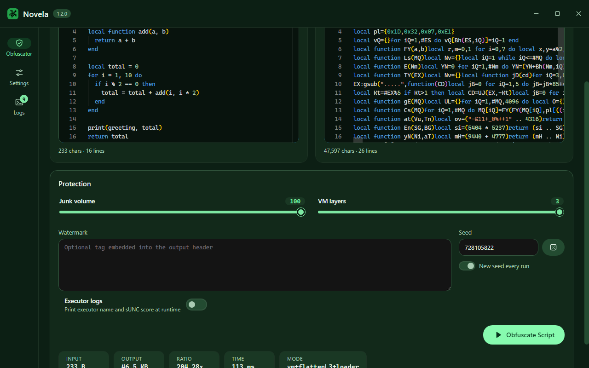
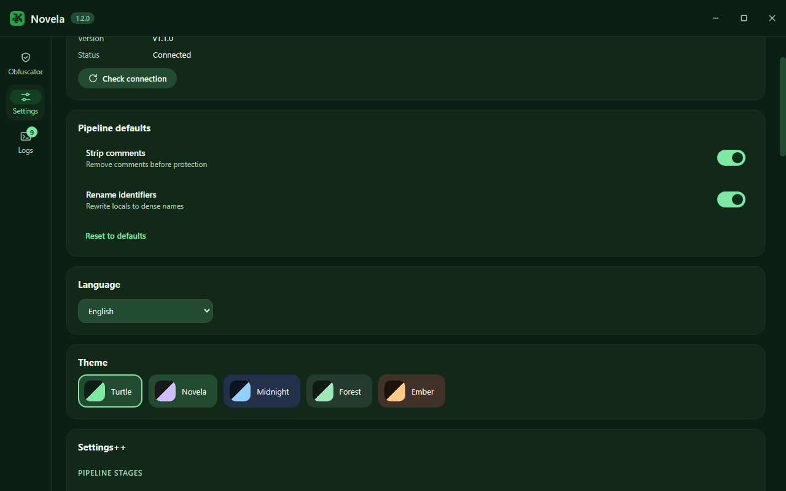
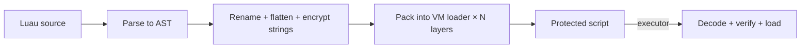

<p align="center"><a href="https://github.com/JustASocial/Novela/releases/latest">

</a>
</p>


<h1 align="center">Novela</h1>


<p align="center">
<b>Desktop obfuscator for Luau scripts</b><br>
Custom VM · Control-flow flattening · String encryption
</p>

<p align="center">


</p>

Novela takes a readable Luau script and turns it into something nobody wants to read: flattened control flow, encrypted strings, junk states guarded by opaque predicates, all packed into a compressed virtual-machine loader. Every build looks different.



## Features

- Custom VM loader (LZ77 + keyed stream cipher + Base85 / Base64 / Hex transport)
- Control-flow flattening with two dispatcher shapes
- String table encryption, identifier renaming, number masking
- Anti-tamper checks, integrity checksum, executor + sUNC report mode
- One-click loadstring via Pastebin / Pastefy
- Built-in HTTP API and optional local server with tray mode
- 12 interface languages, 5 themes, Monaco editing with Luau autocomplete



## How it works



| Layer | What it does |
|---|---|
| Rename | Locals become dense 1–2 letter names (or long noise) |
| Flatten | `if` / loops become a shuffled state machine |
| Strings | Literals move to an encrypted, lazily-decoded table |
| Junk | Dead array-states guarded by opaque predicates |
| Pack | LZ77 → cipher → printable soup in a keyed loader |

## Download

Grab the latest build from the [**Releases**](https://github.com/JustASocial/Novela/releases/latest) page:

| OS | Artifacts |
|---|---|
| Windows | `Novela-Setup-1.2.0.exe` (installer), `Novela-Portable-1.2.0.zip` |
| macOS | `Novela-1.2.0.dmg`, `Novela-1.2.0.zip` (unsigned: right-click → Open on first launch) |
| Linux | `.AppImage`, `.deb`, pacman `.pkg.tar.zst` (plus an AUR template under `packaging/arch`) |

## HTTP API

Run the backend as a server (bundled with the app, or standalone):

```sh
Novela.Core serve --port 4477 --token secret
```

| Method | Endpoint | Auth | Body |
|---|---|---|---|
| `GET` | `/api/health` | — | — |
| `POST` | `/api/obfuscate` | `X-Novela-Token` | `{source, options, seed}` |

<details>
<summary>cURL example</summary>

```sh
curl -X POST http://127.0.0.1:4477/api/obfuscate \
  -H "Content-Type: application/json" \
  -d '{"source":"print(1)","seed":7}'
```

Response: `{success, output, stats, logs, error}`.

</details>

## Loadstrings

Set a Pastebin dev key or a Pastefy API key in Settings, then hit **Loadstring** on any output. Novela uploads it under a random name, copies the raw URL and hands you a ready snippet:

```lua
loadstring(game:HttpGet("https://pastefy.app/xxxx/raw"))()
```

## Settings++

Everything tunable lives under Settings++: ciphers, encodings, VM layers, junk volume and style, dispatcher shape, string splitting, decoys, identifier styles and more.

<details>
<summary>FAQ</summary>

**Where is the obfuscation core?**
It ships as an obfuscated binary inside `resources/core/` (or `core-dist/` for local runs). Its source is not public.

**Do I need .NET installed?**
No. The backend is self-contained.

**Which executors run protected scripts?**
Anything with `loadstring`/`load`: the loader is plain Luau with no external dependencies.

**Where are my API keys stored?**
Only in the app's local settings on your machine. They never leave it except in your own upload requests.

**The output is bigger than the input — is that normal?**
Yes. Junk states, string tables and nested VM layers inflate size on purpose. That is the protection.

</details>

## License

Source of the interface is provided as-is for personal use. The obfuscation core is proprietary and distributed as a binary only.
